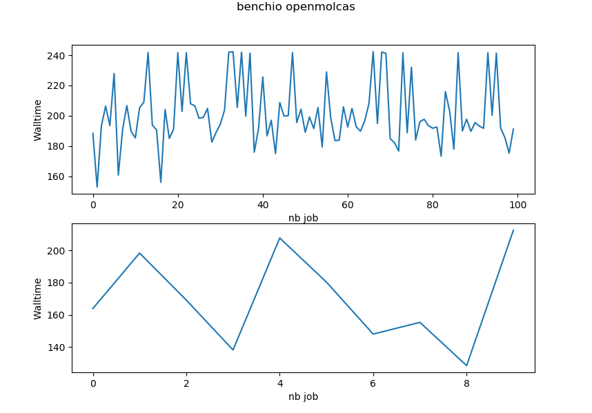

# qmbenchio
An open-source benchmark IO project.


## Overview

* Develop a more comprehensive understanding of the relationships between quantum chemistry software, computing architecture, and simulation performance
* Investigation of storage technology impact on computation times on different scratch disk clusters

Our project begins with the utilization of OpenMOLCAS, a widely-acclaimed and extensively-used quantum chemistry software package, as part of the (ATTOP) project.

## Table of contents:

- [Requirements](#requirements)
- [Installation](#installation)
  - [Docker](#docker)
- [Getting Started](#getting-started)
  - [First step Generate the data](#First step Generate the data)
  - [Second step Launch the jobs and generate output](#Second step Launch the jobs and generate output)
  - [Third Step Analyse the output and generate report or chart](#Third Step Analyse the output and generate report or chart)
- [About Us](#about-us)
- [Acknowledgments](#Acknowledgments)
- [Citing qmbenchio](#citing-qmbenchio)

## Installation
We recommend using Docker installation for reproducibility  

### Docker
```bash
docker build -t qmbhenchio .
```
```bash
docker start qmbenchio
```

## getting-started
A qmbenchio have 3 steps.
* Generate input data for qm software (for example openmolcas)
* Run on Cluster io benchmark using previously generated data
* Post processing of output file to generate Graph or report.

You can run all the step inside the docker container

The configurations of the directory path can be specified through a ini file. 
Examples of ini files can be found in config.ini.
```bash
cat /app/config.ini
```

>[Directories] 
>RawData=../data/raw_data/molcas_test
>ProcessedData=../data/processed_data/molcas_test

run interactively inside the container
```bash
 docker exec -i -t qmbenchio /bin/bash
```

### First step Generate the data

Example for [openmolcas](docs/README_OpenMolcas.md) io 

```bash
cd /app/scripts
python generate_molcas_io_job.py --openmolcas --jobs 10 100 --dir titi
```
>[!TIP]
> if the directories have already been generated the first time, it will only create the slurm files

The script take files in /app/data/raw_data and generate a titi bench with 10 job and 100 identical simultaneous job openmolcas IO input files. 

All files are generated in ProcessedData directory (cf config.ini) 

#### Example for openmolcas io bench 

    ├── processed_data/
    │   ├── molcas_test
    │     ├── titi
    │           ├──  job_10
    │                 ├── ...
    │           ├── job_100
    │                  ├── ...
    └── ...

### Second step Launch the jobs and generate output
You can make this directly in the first step if you add --slurm arg.
If 
```bash
cd /app/scripts
 python generate_molcas_io_job.py --openmolcas --slurm --jobs 10 100 --dir titi
```
This script use 2 templates slurm file in data/raw_data/molcas_test/

> [!IMPORTANT]  
> You have to adapt the tpl files for your cluster

#### Example for our Glicid regional Cluster Nautilus 
```bash
python generate_molcas_io_job.py --openmolcas --jobs 10 100 --dir titi --slurm
```
  .

  ├── job_10
  ├── job_100  
  │── sub_molcas_nautilus_10.sh  
  └── sub_molcas_nautilus_100.sh  

```bash
sbatch sub_molcas_nautilus_100.sh
sbatch sub_molca_nautilus_10.sh
```

### Third Step Analyse the output and generate report or chart
Once the jobs are launched and the calculations are completed. 
Run the program that extracts the values from the molcas outputs The directory must contains output
in all calculations (geom_X) subdirectory

Example of titi directory :

    ├── 100job  
          ├── geom_1  
              ├── geometry_1.xyz  
              ├── mol_input_1.input  
              ├── mol_input_1.output  
              ├── mol_input_1.status  
              └── start.RasOrb   
          ├── geom_X  
              ├── geometry_1.xyz  
              ├── mol_input_1.input  
              ├── mol_input_1.output  
              ├── mol_input_1.status  
              └── start.RasOrb  
          ......

### Extract outputs 
* With a console  :
```bash
python3 extract_benchio.py -b /tmp/titi
```


* With a notebook in the docker container :
The example notebook are in this directory:
```bash
../docs/notebooks/
```

launch Jupyterlab in the container :
```bash
4ef2f4584243:/app#/env/bin/jupyter-lab --ip=0.0.0.0 --port=8886 --no-browser --allow-root
```
and after use the notebook:
http://127.0.0.1:8886/lab/tree/docs/notebooks/openmolcas_extract_bench.jnb.ipynb

## About Us

[The ATTOP team](https://morganevacher.wordpress.com/attop-project-members/)


## 📢  is under active development

## Licence
This program is free software: you can redistribute it and/or modify it under the terms of the GNU General Public License as published by the Free Software Foundation, either version 3 of the License, or (at your option) any later version. This program is distributed in the hope that it will be useful, but WITHOUT ANY WARRANTY; without even the implied warranty of MERCHANTABILITY or FITNESS FOR A PARTICULAR PURPOSE. See the GNU General Public License for more details. You should have received a copy of the GNU General Public License along with Copremo. If not, see http://www.gnu.org/licenses/.

How to cite qmbenchio
If you use qmbenchio to get publisheable results, please cite: A.Blondel, qmbenchio, Nantes University , 2025.

## Acknowledgments
Thanks to thierry Tran (ATTOP project) for the OpenMolcas IO Bench case.

“This benchmark io program used resources of the GLiCID Computing Facility (Ligerien Group for Intensive Distributed Computing, https://doi.org/10.60487/glicid, Pays de la Loire, France) 